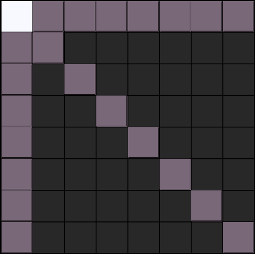

# An Optimization Challenge
[Last time](https://knavely.github.io/blog/peaceable) we introduced the problem, and the software we built to help study it. This time we take a closer look at how **Data Oriented Design** helped us. We develop a succinct representation, which, pretty much hands us a way to at least solve the problem for the original chess board size ($$n \leq 8$$).

Recall: **We are trying to put an army of white queens and an army of black queen on an $$n \times n$$ chess board, such that the armies are the same size, as large as possible,  and they can not attack each other**

The solutions for $$n \leq 15$$ are known on the [OES](https://oeis.org/A250000), and we discuss, at the end of this blog, why our approach here wont scale as is to breach new ground of $$n = 16$$. Still, *we definitely invite you the reader to take a stab at $$n=8$$ before continuing to read this.* Remember, we don't just need a lower bound construction, we need a demonstrably optimal solution.  

# My Backstory 
I was taking John D. Owens's graduate class on Modern GPU Programming at UC Davis in fall 2022, which, btw, I highly recommend for anyone interested in CUDA. Anyway, he basically gave us the Peaceable Queens problem as a challenging homework assignment. *Of course there were ways to receive credit without actually breaking new ground in terms of the OES*, and I think the real point of the assignment was to learn how to use work queues so as to apply an exhaustive branch and bound to definitively solve for as large $$n$$ as possible. 

I started playing around with things on the regular 8x8 chess board. It occurred to me that whereas chess has multiple types of pieces, bishops, pawns, knights, etc, this problem has only Queens, albeit in two colors. Knowing a little about the data structures used in Chess Engines, it seemed possible to get a very concise representation of the Peaceable Queens: Could we use a single $$\texttt{uint64}$$ to represent the white queens? Can we efficiently use bit-wise operations to then compute black? And down the rabbit hole I went...   

# BitBoard Representation
It's easy to take a page out of chess programming here. Engines like Stockfish need to compute and evaluate vast numbers of positions in the game tree, in order to pick the best move to take. The less memory used to represent a position means more of the game tree can be considered, which directly results in increased quality play, or in other words smarter AI. 

Well, what exactly is a "Chess Position"? *It's the locations of the pieces*

What is a "Location"? *it's one of the 64 squares on a chess board*

What is the most compact way we can represent 64 squares? *We need 64 bits at least, or an 8-byte word type such as $$\texttt{unsigned long long}$$ in C*

So we can take 64 bits, and map each one to a unique square on the $$8 \times 8$$ board. If there is a white queen on a square we set the corresponding bit to be $$1$$, and $$0$$ otherwise. 

**Note:** In the actual game of Chess, we need 64 bits for **each type of piece**. That is, 64 bits for all of the pawns, 64 bits for all of the rooks, etc. Here in Peaceable Queens land, we only have one piece type. Queens. So we only need 64 bits total!

**What about the Colors?** Right, there are actually white and black queens. But what are we actually trying to do here? We are finding the largest $$m$$ so that we can put $$m$$ white, and $$m$$ black queens on the board, and the two armies will be non-attacking.

**What if we have a cheap function that can compute which squares one set of queens can attack?**
In this case, given the positions of the white queens, we could in fact compute or infer the positions of the black queens! These squares would be computed using bit-wise logic:

$$\texttt{black_queens} = \overline{\texttt{white_queens} | \texttt{attacked_squares(white_queens)}}$$

And of course by symmetry:

$$\texttt{white_queens} = \overline{\texttt{black_queens} | \texttt{attacked_squares(black_queens)}}$$

Every square that is not attacked or has a white queen on it, should be a black queen. It is quickly handed by some trivial Boolean logic. **Good things happen implicitly when we explicitly find a bit-wise representation.** Some C code:
```C
typedef unsigned long long BOARD;
BOARD attacked_squares(BOARD b);
\\ etc...
BOARD compute_black_queens(BOARD white_queens){
	BOARD back_queens = !(white_queens | attacked_squares(white_queens)); 
	return black_queens;
	}
```
That's just "a couple" of CPU cycles! It's so cheap, we don't even need to store the other color. Just compute it. At this point it's probably worthwhile to take a second to convince yourself of the following observations:

<span style="color:gold;font-weight:700;font-size:20px">
Given an uneven position with $$W$$ white queens and $$B$$ black queens, with $$W > B$$ we can obtain an even position with $$W$$ white and $$W$$ black queens. 
</span>

This is because we can always remove excess queens from the larger army. This plus the fact that the armies must be non-attacking, means that we **only need one color's position to completely characterize a solution**

Before we tackle how to implement the **attacked_squares** function, lets go through all of this by hand.

## Walking Through the Bijection


Let's take this "position" on the $$8 \times 8$$ board and convert it to bits. The first thing we need to do is to linearize the $$8 \times 8$$ board into 64 sequential bits. This is fairly straightforward assuming 0 based indexing on the 2d grid of squares: $$\phi: [0,\ldots, 7] \times [0,\ldots, 7] \rightarrow [0 \ldots 63] $$

$$\phi(a,b) = 8a + b$$ 

As a sanity check, we see that the white queen above is at square $$\phi(0,0) = 0$$, and the first black queen is at $$\phi(1,2) = 10$$ in the 0 based linear ordering. The values of $$\phi$$ tell us which of the 64 bits we need to **turn on**. So here

$$\texttt{white_queens} = 000000000000000000000000000000000000000000000000000000000000000001$$

How about the squares it can attack? Lets get explicit and just type them all out. Those are all the grey ones:

$$A:= \{(0,1),(0,2),(0,3),(0,4),(0,5),(0,6),(0,7),(1,0),(2,0),(3,0),(4,0),(5,0),(6,0),(7,0),(1,1),(2,2),(3,3),(4,4),(5,5),(6,6),(7,7)\}$$

Now $$\phi(A) = \{1,2,3,4,5,6,7,8,16,24,32,40,48,56,9,18,27,36,45,54,63\}$$
Which as 64 bit-wise representation is:

$$\texttt{attacked_squares(white_queens)} = ??$$

First lets compute the squares on the diagonal:

$$\texttt{attacked_diagonal} = 1000000001000000001000000001000000001000000001000000001000000000$$

Now the left column:

$$\texttt{attacked_column} = 000000000100000001000000010000000100000001000000010000000100000000$$

And finally the easiest one, the row:

  $$\texttt{attacked_row } = 000000000000000000000000000000000000000000000000000000000011111110$$ 

And so we can just OR-em together.

$$\texttt{attacked_squares} = \texttt{attacked_diagonal} | \texttt{attacked_column} | \texttt{attacked_row}$$

which ok, lets get crazy and actually do this (omg)

$$\texttt{attacked_squares(white_queens)} = 1000000101000001001000010001000100001001000001010000001111111110 $$

And now we can compute black which is just the bit-wise inverse of the attacked squares ORed with white:

$$\texttt{black_queens} = \overline{\texttt{attacked_squares(white_queens)} | \texttt{white_queens} }$$

$$ = 011111101011111011011110111011101111011011111010111111000000000$$

OK, that's about as much manual 64-bit flipping as I can handle here, but hopefully it illustrates what is going on. It might be annoying for humans to think of it all in bits like this at first, and you may be saying "well this is a very simple, very contrived example with just a single queen in the corner", but the reality is that computers love this stuff, and it doesn't make a darn bit of difference -- all of the bit sequences are equally complex to it.  

# Can you Code This ?
Absolutely. Here's a big hint:

At first glance things may seem slightly messier than they really are. Remember, given the positions of the white queens, we compute black by **ORing the white queens with the squares they can attack**. In effect this means we **really dont care if there is a white queen on the square or if it's an empty square that can be attacked by one**.  

With that in mind, it's fairly straightforward to just go row by row, then column by column, then diagonal by diagonal and compute the attacked squares because
**if there is one queen on a row, diagonal or column, then all the squares on the row, diagonal or column can be effectively attacked.**

You might want to think about this. It's another place where thinking in terms of **data** rather than **objects** really shines, because it enables us to calculating something about all of the queens at once, in a sort of "bit-wise parallelism". 

More good news, is that each row (resp. col, diag) can be computed entirely at once, with a single bit-wise AND operation. For example how can we find the squares on the first row, that either contain a white queen or can be seen by one? First lets make a bit mask for the row:

$$ \texttt{row_one} = 000000000000000000000000000000000000000000000000000000000011111111$$

I think will stop writing 64 bits in their entirety everywhere, and switch the representation you'd actually use to write the code. How do we set the least significant 8 bits?

$$\texttt{row_one} = 2^8 - 1 = \texttt{(1 << 8) - 1} $$

Notice that now we can easily get any other row $$k$$ simply by shifting this one. 

$$\texttt{row_k} = \texttt{(row_one << (k-1)*8) } $$

Now we simply need to test if there are **any queens on a given row** and if there are, set the whole thing to be ones.

$$\texttt{attacked_on_row_one = (queens & row_one) ? row_one : 0} $$

Now we simply do this for all the rows, all the columns, and all the diagonals, then OR them all together and take the bit-wise inverse and we have computed the other color!

$$\texttt{black_queens} = \overline{ \texttt{attacked_on_rows} | \texttt{attacked_on_col} | \texttt{attacked_on_diag} | \texttt{white_queens}} $$

How long does this all take? Well, ignoring opportunities for various forms of parallelism, there are 8 rows, and we do 8 bit-wise and operations, and 8 bitwise not operations. So that's like 16, and to compute black entirely 48 CPU cycles. How fast is a CPU cycle? Something like less than one billions of a second. Bottom line is that given one color, we can quickly compute the other. 

# Computer Proof of Optimality

## The Approach
Remember our <span style="color:gold;font-weight:700;font-size:20px"> Observation </span> from above. If we have a solution where both black and white have $$k$$ queens, we can automatically get one where they each have $$k-1$$ or less. 

We can use this fact to brute force to a solution. Find the smallest $$k$$ such that there is no solution of value $$k$$. That is, **every configuration with $$k$$ white queens gives fewer than $$k$$ black queens**. Then the <span style="color:gold;font-weight:700;font-size:20px"> Observation </span> implies that there also can't be a solution of value more than $$k$$ either, and indeed that the optimal is $$k-1$$.

So we can start with, say, $$k = 1$$, test all 64 bit sequences with exactly k bits set. OK, there are a couple of very legitimate questions that present themselves now

* **How many of these sequences are there ?** 
There are $$\binom{64}{k}$$ boards with $$k$$ queens set. It's a little hand wavy, but we should terminate with a $$k$$ small enough, before this explodes. To see this, we can just forget about the diagonals and have at most $$16$$ *peaceable rooks*. This is a crude upper bound, which has recently been [improved]("https://arxiv.org/abs/2406.06974"), incorporating diagonals to give something like ~ $$0.17 \cdot 64 \approx 10$$. Now this is still a rough upper bound, which doubtfully holds with equality at such a low value of $$n$$, thus, it makes sense to start with $$k = 9$$, $$\binom{64}{9} \approx 27 \text{billion}$$
* **How can we quickly find them ?** 
  We've been a bit hand-wavy, but it seems we will need at least 1 minute to find the number of black queens in all of these boards, if we were to just be handed them. 

To summarize, we are going to 

	A. (somehow) go through all 64 bit integers with exactly k ones. For each one   
		i. Compute the black queens as discussed above
		ii. Count the number of black queens
		iii. If this count is at least k report a valid solution and set k := k+1, and goto A.
	
## The Inner loop
  We have already covered how to compute black as a 64 bit integer, given white represented as a 64 bit integer. We have not discussed how to actually count the number of queens. For this we can throw in a little **hardware acceleration** by using
  
  $$\texttt{__builtin_popcountll}$$
  
  (GPU versions also exist)
  
  As you can see, the code will be calling this thing almost constantly so it's great to get some low level support! I guess people have been interested in counting the number of ones in addressable types for a while. :-) 

## The Outer Loop

So, given an $$\texttt{int64}$$ with exactly $$k$$ bits set, we know what to do. All that is left is to discuss how to traverse these sequences. Time to break open [Knuth vol 4](https://www.amazon.com/Art-Computer-Programming-Combinatorial-Algorithms/dp/0201038048). I just used the x86 hardware accelerated lexicographic next implementation given here [Sean Eron Anderson's page of Bit Twiddling Hacks](https://graphics.stanford.edu/~seander/bithacks.html#NextBitPermutation).

Each time we increase $$k$$ we set the initial sequence to be $$\texttt{(1 << k) - 1}$$.
## Running the "Proof" for $$n = 8$$

As discussed above, it makes sense to start with $$k = 9$$, which we find a solution for almost immediately: the lexicographical "lowest" optimal solution for $$n = 8$$: 


Which as binary maps to $$000000000000000000000000000000000000000000000000100110001101100011 = 156515$$. The smallest "peaceable queen number" perhaps? :-)

Shifting up to $$k = 10$$ we have to make it through some 150 billion sequences, which will take, literally all day on a modern CPU, but it will eventually terminate having not found a solution. "QED" !

## Hardware Acceleration
Certainly GPU's could be effective for larger board sizes. SIMD is probably an option as well, even for smaller sizes.

# Larger $$n$$ ?
According to the [OES](https://oeis.org/A250000), it would actually be useful if we could do this for $$n = 16$$, since that is the smallest unknown value for $$a(n)$$. 

The Ainley construction gives 37:


Following the approach here would mean to start with $$k = 38$$, and test all $$\binom{256}{38}$$ bit sequences of length $$16\times 16 = 256$$ with exactly $$38$$ bits set, as we did above, and then compute and verify that we always get fewer than $$38$$ black queens. Unfortunately there are over $$3 \cdot 10^{45}$$ such sequences!  

So, unfortunately this approach doesn't quite scale sufficiently as is. Can we reduce the $$\binom{256}{38}$$ search space somehow?  Proving even "obvious" properties about this problem, has been remarkably difficult!  

# Wrapping Up
So we have seen that a couple of easy observations and a bit-wise representation is enough to engineer a solution for small boards. Unfortunately it doesn't really scale. 

**Next Time (if there is a next time)** we will dig into the *non-linear optimization models* [given here](https://arxiv.org/abs/2406.06974) to get **upper bounds** that hold asymptotically for large $$n$$. 


