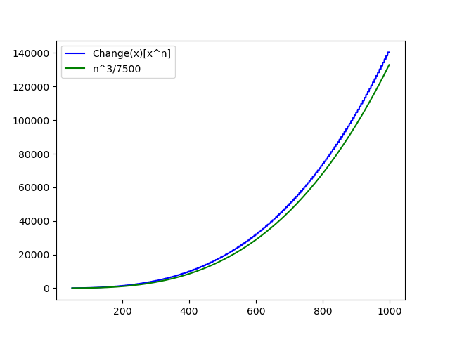

# Part I Bonus
OK, I was saving this real-life material for "the book" but just realized soon people will *not know what coins are* , and 90% of the background was covered in 
[Part I](https://knavely.github.io/blog/roll).

## The Interview

Around 2011 I was on the Software Engineering job market, and I landed a phone interview at a "hot, new SF based social network" that enforced strict 142 character limits. Since I lived in SF, I was mildly optimistic about the opportunity.

Anyway, Here's how the call went down:

Interviewer:  ``I would like you to write a piece of code that determines the number of ways to make change for $1.00.
`` 

Me: ``OK, are these variable coin denominations or standard US ones?``

Interviewer(yawning): ``Standard``

Me: ``Do you just want the count or the actual collections of coins?``

Interviewer: ``Just the count, but you should get started, we only have 30 mins.``

As a GF fanatic, this was just what I had always waited for!

## Some Code
This blog is about connecting Programming Languages with Generating Functions, so lets quickly code a solution here in Python, recursively conditioning on the largest coin available. *We will soon see this as a GF one-liner...*
```python
In [25]: def change(n, avail):
    ...:     if n < 0:
    ...:         return 0;
    ...:     else:
    ...:         match avail:
    ...:             case [1,5,10,25]:
    ...:                 return change(n-25,[1,5,10,25])
    ...:                 + change(n-10,[1,5,10]) + change(n-5,[1,5]) + 1;
    ...:             case [1,5,10]:
    ...:                 return change(n-10,[1,5,10]) + change(n-5,[1,5]) + 1;
    ...:             case [1,5]:
    ...:                 return change(n-5,[1,5]) + 1;
    ...:             case [1]: return 1;
    ...: 

In [24]: change(100,[1,5,10,25])
Out[24]: 242

```
## The GF Solution
This question is actually very similar to what we did with the trivial dice example in [Part I](https://knavely.github.io/blog/roll). In fact it's even easier in some ways because we don't need to worry at all about probability. Our goal is to find the coefficient of $$x^{100}$$ in  


<span style="color:lightgreen;font-weight:700;font-size:20px">
$$\texttt{change(x)} := c_0 + c_1x^1 + c_2x^2 + \ldots + c_{100}x^{100} + \ldots$$
</span>

Where 
<span style="color:lightgreen;font-weight:700;font-size:20px">
$$c_k = \texttt{change(x)}[x^k] := \text{the number of ways to make change for k cents}$$ 
</span>

Which is great because it's highly probable that a followup question could be to make change for $$n$$ cents.

(Probably worth taking a minute here to consider how you'd program a solution? Watch out for Stack-Overflow!)

OK, we are going to introduce a GF for each coin type

<span style="color:lightgreen;font-weight:700;font-size:20px">
$$\texttt{penny(x)} := 1 + x + x^2 + \ldots + x^{100} + \ldots = \frac{1}{1-x}$$
</span>

<span style="color:lightgreen;font-weight:700;font-size:20px">
$$\texttt{nickel(x)} := 1 + x^5 + x^{10} + \ldots = \frac{1}{1-x^5}$$
</span>

<span style="color:lightgreen;font-weight:700;font-size:20px">
$$\texttt{dime(x)} := 1 + x^{10} + x^{20} + \ldots = \frac{1}{1-x^{10}}$$
</span>

<span style="color:lightgreen;font-weight:700;font-size:20px">
$$\texttt{quarter(x)} := 1 + x^{25} + x^{50} + \ldots = \frac{1}{1-x^{25}}$$
</span>

Now based on our work last time we have

<span style="color:lightgreen;font-weight:700;font-size:20px">
$$\texttt{change(x)} = \texttt{penny(x)} \cdot \texttt{nickel(x)} \cdot \texttt{dime(x)} \cdot \texttt{quarter(x)}$$
</span>

<span style="color:lightgreen;font-weight:700;font-size:20px">
$$= \frac{1}{(1-x)(1-x^5)(1-x^{10})(1-x^{25})}$$
</span>

Getting an exact answer is now just a matter of somehow actually doing all this multiplication, or at least enough of it to get the first 100 terms. 

Believe it or not, at this point we have already done enough to obtain an approximate result via **Proposition IV.2** from [Analytic Combinatorics by Flajolet and Sedgewick](https://ac.cs.princeton.edu/home/AC.pdf), and exactly using a symbolic mathematics package.

<span style="color:lightgreen;font-weight:700;font-size:20px">
Proposition IV.2
</span>
>If $$\mathcal{T}$$ is a set of coin denominations with no common divisor, the number of ways to make change for $$n$$ cents is asymptotically approximate to 
>$$\frac{n^{|\mathcal{T}|-1}}{w(|\mathcal{T}|-1!)}$$.  
> Where $$w = \prod_{t \in \mathcal{T}}t$$.

In our case of course $$\mathcal{T} = \{1,5,10,25\}$$ giving 
<span style="color:lightgreen;font-weight:700;font-size:20px">
$$\approx \frac{100^3}{7500} \approx 133$$
</span>

How close is the approximation? Lets plug 
$$\frac{1}{(1-x)(1-x^5)(1-x^{10})(1-x^{25})}$$
into Wolfram Alpha or Sage, and ask it to expand up to 100 terms. This will also sanity check our Python efforts above.

<span style="color:gold;font-weight:700;font-size:20px">
$$\texttt{change(x)}[x^{100}] = 242$$
</span>
 As expected, and showing that approximation was off by a factor less than 2. How well does this approximation fit as we increase $$n$$ ?



The Math Works!

## Wrapping Up
Basically, knowing exactly, or even approximately how big a collection is, allows us to **allocate memory upfront** which can be a huge advantage in all sorts of implementation scenarios. Can we use static memory ? can it all be contiguous ? How many bits do we need? etc.. 
Once we have even a decent approximation of the number, we can begin to craft a way better implementation than otherwise. 
