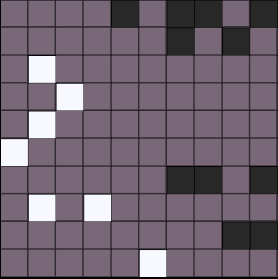
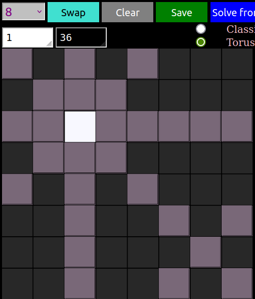
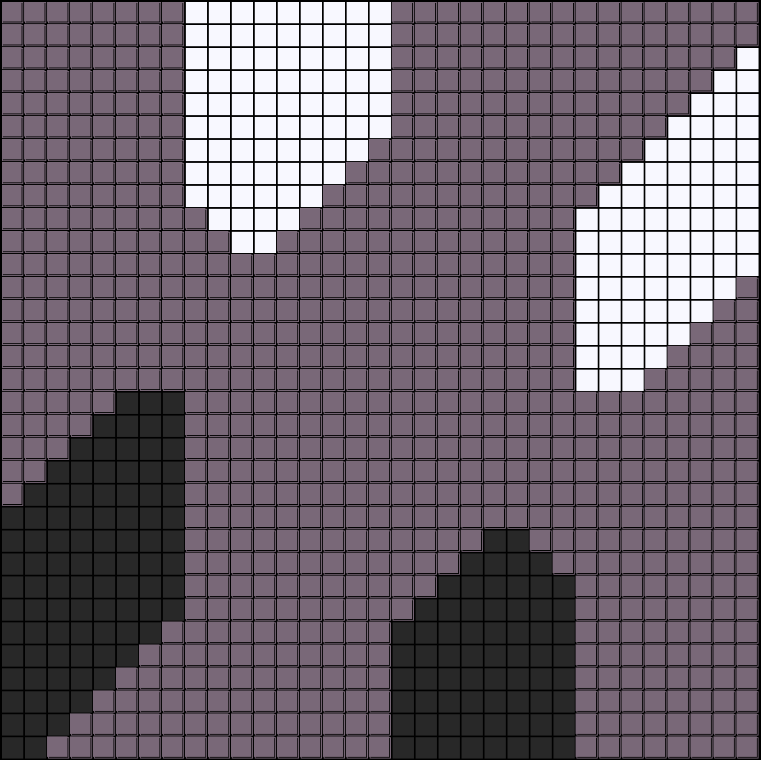
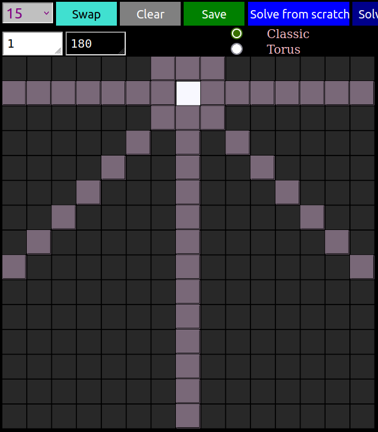

# Like a Rubik's cube of Chess 
I have been low-key obsessed with this problem for a few years now. Possibly because it combines computing, math, and chess. But actually I think its just a great puzzle, that is very addicting, and challenging! It was very easy to get lost looking at the conjectures, related problems, open questions on the [OEIS](https://oeis.org/A250000).

Our work lead to an academic [paper](https://arxiv.org/abs/2406.06974), but I wanted to say something about the process, so I decided to write this blog series. The first entry will be about introducing the problem, and some software I built which helped in studying it. The second entry will be more about programming: **using a data oriented design** approach to build the software.

Disclaimer: This is not about the  popular tech interview puzzler [N Queens Problem](https://en.wikipedia.org/wiki/Eight_queens_puzzle), which is a good exercise in algorithm design. The Peaceable Queens we are talking about here though is actually an open research problem.  

# Armies of Peaceful Queens

We are trying to find **the maximum number $$a(n)$$ such that $$a(n)$$ white queens and $$a(n)$$ black queens can coexist on an $$n \times n$$ chessboard.**
(note that one of the sides is allowed to have *more* than $$a(n)$$).
i.e. **No white queen can capture a black queen but queens of the same color can, as usual in chess, be within each others field of vision**.

In order to display things more simply, we use a grey $$n \times n$$ grid, with colored squares instead of queen shapes. 

Here we have a $$10 \times 10 $$ board, with $$7$$ white queens and $$11$$ black queens. Since none of the queens of opposite color can take each other, this is a valid position for the Peaceable Queens problem, although it is not optimal since the configuration below is better. It has $$14$$ queens of each color ($$14 > 7$$).

The [OEIS](https://oeis.org/A250000) is trying to collect as many terms as possible, but so far  only the first 15 terms are definitively known. So, it's both a fun, challenging puzzle, with the tantalizing possibility that a solution will either exceed the best known so far, or will shed light on one of the conjectures people have made on the site.

For more inspiration check out this excellent [2019 video by Neil Sloane](https://www.youtube.com/watch?v=IN1fPtY9jYg). Here [Richard Green](https://apieceofthepi.substack.com/p/peaceable-armies-of-queens) has a blog post covering more recent progress.

You may notice mention of studying Toroidal boards, and see that option in the app. However, we will save that for next time. **Here in this walkthrough we will stick with the classic chess board**.

## Just ask ChatGPT ?
In case you were wondering, this was what ChatGPT spat out when I asked it to solve for $$n=4$$

Apparently it doesn't understand that in chess queens can move diagonally... and even then, it only has $$13$$ white queens (see below, 14 is possible). And that depiction of the toroidal board really cracks me up for some reason... I guess **Combinatorial Optimization** aint dead yet !

BTW, the recent Sept 2024 o1-preview didn't perform any better. 

## 8 x 8 Classic Board 
Can you solve the problem on the original chess board ? The first thing I noticed when I wanted to start tinkering around with this problem was that it was just sort of painful. Kept drawing grids on paper, and as much as I love [lichess](https://lichess.org) for the actual game of chess, it's board editor just isn't made for this. So, I hacked together [this app](https://knavely.github.io/pieceable/) (absolutely no data is collected or anything. It runs fine in your browser offline), which helped us to write the paper [Constructions, bounds, and algorithms for peaceable queens](https://arxiv.org/abs/2406.06974). 

	1.  Possibly resize your browser by adjusting from the lower right corner
	2.  Change the selection from **15** to **8** in the drop down 
	3.  It should look something like the below, with the green outline tracking your mouse
	

Now you have an 8x8 board of dark squares. In fact there are 64 "black", 0 "white" as indicated by the number in the white/black box. Our starting state here is a board full of 64 black queens.
	
	

	
	4. Highlighted are the selected squares 'field of vision'. 
	5. Click again to place a white queen on that square
	
You can now experiment with the radio button, selecting "Torus" or "Classic" mode. Watch how the *field of vision* changes.

	
	6. The highlighted area is now grey, representing neutral part of the board (containing no queen)
	7. The white score box has changed from 0 to 1 indicating that there is now 1 white queen.
	8. That the black score box has changed from 64 to 36 indicating that 18 black queens have now fled
	9. Click on the square one more time to remove the white queen and return the 64 black queens

Now it's time for some fun. What is the "best" solution you can find that has the largest number of equal black and white queens? You should be able to at least beat this in-optimal example that gets 5:

	10. When you get bored, or you think you have found a maximum click "Solve from Scratch".
	Does the solution surprise you? (ignore Solve from Here)
	11. Click it a few more times to some variety.
	
Notice that you can edit any of these configurations by clicking to add white queens. What about adding a black queen? Notice that the black squares are computed on the fly. They are just **all of the squares not covered by white queens**. So to edit black queens 

	12. Click Swap. This swaps the two colors and then you can edit the board
	13. Note: by definition swapping might increase the number of queens
	
This is because there may have been squares that were not attacked by black. Swapping will put queens on these squares. See below, 4 queens are added to white(now black) in the swap.

## Can you solve 8 x 8 ?

Can you beat 5?

Would you have guessed that you can fit $$m = 9$$ white queens and $$9$$ black queens in a non-attacking way on an $$8\times 8$$ chess board? It turns out that $$9$$ is the best we can do when $$n = 8$$. Try some different board sizes. 

# Larger board sizes

I almost jumped out of my chair the first time I encountered this Ghostie in my Machine! It's not optimal thankfully, because that would be very frightening.

	14. use the drop down to change the size of the board to 15

## Ainley 1977
The first known reference to this problem is from Ainley's 1977 book [Mathematical Puzzles](https://oeis.org/A250000/a250000_5.png). In which he actually gives a construction, pictured below for $$n=33$$, which achieves $$\frac{7}{48} n^2$$ for the smaller side. 

## Largest Aggressor 
Bob Selcoe notes on [the oeis](https://oeis.org/A250000) that it is possible to have a solution with 32 white queens and 34 black queens (pictured below).  

In fact, it is conjectured [in it's own oes entry](https://oeis.org/A308632), that for an optimal solution for any $$n$$, the difference between the largest aggressor and the smaller army is at most $$2$$.

**Can you find a counter example?** 

There are many conjectures and questions to dig into on the OES. 

For what it's worth, we believe that it's possible to extend the upper bound techniques in [Constructions, bounds, and algorithms for peaceable queens](https://arxiv.org/abs/2406.06974), to show that the Ainley construction is at least asymptotically optimal for large $$n$$. 

# Less is known about the Torus
suppose we let the lines wrap around, like in Pac-Man where he comes out on the other side of the screen after eating the strawberry (or as [Richard Green](https://apieceofthepi.substack.com/p/peaceable-armies-of-queens) perhaps more clearly if you have played it, the classic game Asteroids.)

[image from](https://www.pinterest.com/bloemendal2386/)

On the left we see one queen on the regular board casting her usual shadow. On the right we switch over to the torus, notice how the diagonals now wrap around. Seeing how this works, to extend the notion of diagonals to the torus, might not be totally obvious at first but if you just apply the rules **left + down** and **right + up** to "wrap around" it should hopefully start to make sense!

 Now the queens cover more territory, so the solutions to the regular board no longer apply. [This Toroidal Problem](https://oeis.org/A279405) has it's own entry on the oeis, and only $$12$$ terms are definitively known at the moment.

# Counting the number of Solutions

This is also something [people are interested in](https://oeis.org/A260680) .

## Tune in next time, where we will show how we can use **Data Oriented Design** to brute force through **all optimal solutions** on the original board for $$n = 8$$, in just a few hours of computation.

