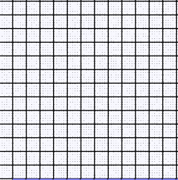

I have always felt that **Generating Functions(GF)** are like a programming language. Except instead of being about transistors and turning bits on and off, they are hacking the invisible formless Math machine that permeates our universe and collective imagination. So, I thought I'd (attempt to) write a programming style tutorial for this classically mystifying area in the border lands of Mathematics and CS, which has been colorfully dismissed by more than one mathematician as: 
> Like putting Water into Snake Oil !

In fact Herbert Wilf has apparently embraced description, and he even has a "Snake Oil Method" in his classic text [generatingfunctionology](https://www2.math.upenn.edu/~wilf/gfology2.pdf).

# A Programmatic Teaser
A formal power series is a little bit like a vector or other sequence Data-Structure. Take a Linked List with $$n$$ items as a example (the arrows are pointers, and the values are the $$v_i$$). 

$$\texttt{List li} = \texttt{head} \rightarrow v_0 \rightarrow v_1 \rightarrow \ldots \rightarrow v_{n-1} $$

(Of course there are other snazzy recursive definitions as well)

Typically operations include:

1.  
	
	$$\texttt{head(li)} = v_0$$
	
	*Return first element*
	
2.  

$$\texttt{tail(li)} = [v_1,v_2,v_3,\ldots,v_{n-1}]$$

*return the rest of the list*
3.  

$$\texttt{sum(li)} = \sum_{i=0}^n v_i$$

4. 
$$\texttt{even(li)} = [v_0,v_2,v_4,\ldots]$$

*even indexed sub list*

5. 
$$\texttt{prefix-sum(li)} = [\sum_{i=1}^k v_i \texttt{ for } k < n]$$

6. 
$$\texttt{append(li,v)} = [v,v_0,v_1,\ldots,v_n]$$

These should all be more or less familiar to programmers.

Now lets look at how a formal power series can easily support the same operations!

Our definition comes from not doing much more than swapping the $$\rightarrow$$ with the $$+$$.

$$\texttt{li}(x) = v_0 + v_1x^1 + v_2x^2 + \ldots + v_nx^n$$

Our little mathematical object here is storing the same information but in it's coefficients. 

1.  
	
	$$\texttt{head(li(x))} := \texttt{li}(0) = v_0$$
	
	*Return first element*
2.  

$$\texttt{tail(li(x))} :=\texttt{li(x) - li(0) } = v_1x^1 + v_2x^2 + \ldots + v_nx^n$$

*the rest of the list*

3.  

$$\texttt{sum(li(x))} :=\texttt{li(1)} = v_0 + v_1 + \ldots + v_n$$

*sums the "list"* 

4. 
$$\texttt{evens(li(x))} :=\frac{\texttt{li(-x) + li(x)}}{2} = v_0 + v_2x^2 + v_4x^4 + \ldots$$

*even indexed sub list*

5. 
$$\texttt{odds(li(x))} := \texttt{li(x)} - \texttt{evens(li(x))}$$

6. 
$$\texttt{prefix-sum(li(x))}:= \frac{\texttt{li}(x)}{1-x} = v_0 + (v_0+v_1)x^1 +(v_0+v_1+v_2)x^2 + \ldots + \sum_{i=0}^k v_ix^k$$

*prefix-sum*

6. 
$$\texttt{append(li,v)}:= v + x\texttt{li(x)} = v' + v_0x^1 + v_1x^2 + \ldots + v_nx^{n+1} $$

*append*

Of course there are many things programming languages do that formal power series can not, in some cases it goes the other way as well. Like concisely representing an infinite number of 1s

$$\texttt{ones(x)} = 1 + x^1 + x^2 + \ldots  = 1 + x\texttt{ones(x)}$$

therefore

$$\texttt{ones(x)}(1-x) = 1$$, so that $$\texttt{ones(x)} = \frac{1}{1-x}$$

I will try explain the magic from first principles and to give you, a practitioner of some sort, a tool you can use with working confidence. I'm doing my best to keep things informal, and intuitive, and so bound to offend formalist mathematical nit-pickers in one way or another.  
Generating Functions have blown me away since I was a first year student. I routinely stayed up all night trying my GF solutions to various enumerative challenges. Verification was always a challenge because somehow we always mistrusted ourselves : In vain computational efforts like Maple/Mathematica timeouts, and more often than not resorting to brute force on the huge whiteboard we had in our flat with my roommate Clint, who was always a great sport. We even got thrown out of a Peterborough Ontario coffee shop late one night "for having a super lame math fight", as the barista described it...hey it's all fun and games until it's 3:00 and there are random walks with complex boundary conditions to contend with! 

Generating Functions are a tool that continue to be useful in a surprising range of Math and CS. I can not remember any of those formulas from Discrete Math 101 for "distinct slots into indistinct objects with/out replacement, etc.." but Generating Functions provide a general framework for solving all sorts of problems. Yes, there are often other domain specific ways to go about things, knowing the GF framework removes a lot of memorization, e.g. the Master Theorem from Analysis of Algorithms.  GFs have come in handy for Probability, Analysis of Algorithms, Recursion, Branching Processes, various Enumeration for its own sake... This blog is my attempt to impart some of those early fun times of being simultaneously mesmerized and confused.  

# Why are they called Generating Functions?
Call me old-fashioned, but I tend to think that names of things are there to convey useful information about the thing they are the names of... I think a lot of people tend skip with this stuff. In fact, I am not sure I have ever had it explained to me. Once it clicks of course, the name makes sense, but before then one's imagination can easily get the better of them. especially if you are familiar with other mathematical concepts that sound similar, which of course then is made more confusing by the fact that all of Mathematics is somehow connected... 

*  NOT _Generators of algebraic group_. OK, they are algebraic objects but we aren't really concerned Abstract Algebra here. 
*  NOT _Generating Random Numbers/Objects_ Confusingly there is some relation but it's not the reason for the name
*  NOT generative AI (I guess these days you have to say this)
*  My guess is that they are called this because, the process in which they are constructed "generates" coefficients of great interest 

Now, lets do a little **Hello World** example, which we will explain so thoroughly, that it will be enough to call it a day. 

# Magical Dice Challenge (Easy)

``Write some code in the programming language of your choice, or calculate otherwise, the expected sum of rolling two magical dice. One is (somehow) 3 sided, the other is 4 sided, except that it is magic, and sometimes(with uniform probability) it dissapears into an alternate dimension when rolled.``

This is certainly not meant to be hard. Almost any technique will work, but you might be surprised that a solution boils down to not much more than writing two small polynomials and multiplying them together.

Recall the definition of expected value. Let sum denote the outcome of the first dice + the second dice when rolled. We need to compute  

$$\mathbb{E}(\text{dice sum}) = \sum_k k\mathbb{P}(\text{dice sum}=k)$$

 To do this we just have to figure out two things: the total number of outcomes (denominator), and the total number of outcomes for each particular sum (numerator).
# Three sides of Dice I
Instead of labeling the sides numerically, do it with powers of $$x$$

When we roll it we could get $$x^1$$ OR $$x^2$$ OR $$x^3$$, replacing the OR with $$+$$ gives us the algebraic generating function interpretation 
 $$D_1(x) := x^1 + x^2 + x^3$$  

# Four sides of Dice II + Disappearing non-side

$$D_2(x) := x^0 + x^1 + x^2 + x^3 + x^4$$  

# Rolling the Dice is the same as doing algebra
Clearly the coefficients of $$x^i$$ in $$D_1$$ and $$D_2$$ correspond to the number of ways of rolling that side. Namely they are all $$1$$ or (implicitly) $$0$$. 

Slightly less obvious is that the coefficient of $$x^i$$ in the product $$D_1 \cdot D_2$$ is the number of ways of rolling $$i$$ as a sum of both dice. 

$$\text{Roll}(x) := D_1(x) \cdot D_2(x) = (x + x^2 + x^3) \cdot (1 + x + x^2 + x^3 + x^4)$$ 

$$=(x\cdot1 + xx + xx^2 + xx^3 + xx^4) + (x^2 + x^2x + x^2x^2 + x^2x^3 + x^2x^4) + (x^3 + x^3x + x^3x^2 + x^3x^3 + x^3x^4)$$

Why am I doing this? No, I didn't forget how to multiply polynomials, but it's here in this step that the important mechanics happen, and I want to proceed in slow motion so we don't miss it. Pay attention to the exponent here. We can re-write the above to be even more deliberate.

$$= (x^{1+0} + x^{1+1} + x^{1+2} + x^{1+3} + x^{1+4})$$ 
$$+ (x^{2+0} + x^{2+1} + x^{2+2} + x^{2+3} + x^{2+4})$$ 
$$+ (x^{3+0} + x^{3+1} + x^{3+2} + x^{3+3} + x^{3+4})$$
	

Each exponent here corresponds to the sum of the two dice outcomes. When we combine like terms, the coefficients give the corresponding number of outcomes. 
		
The terms above correspond to the individual dice outcomes:  

$$\Rightarrow x^1x^2 = x^{1+2} $$

$$ \Rightarrow x^2x^0 = x^{2+0} $$

$$  \Rightarrow x^3x^2 = x^{3+2}$$

etc..

Simplifying (combining like terms) gives the coefficients. For instance $$1 + 3, 3 + 1, 2 + 2 $$ are all three ways that the sum comes out to $$4$$, and therefore we get $$3x^4$$ as a term in the final result (because of course of $$x^{1+3} + x^{3+1}+x^{2+2}$$ in the expression above). Combining like terms we arrive at
	

$$\text{Roll}(x) = 1x^1 + 2x^2 + 3x^3 + 3x^4 + 3x^5 + 2x^6 + 1x^7$$  
	

Since the coefficient of $$x^k$$ gives us the number of outcomes that sum to $$k$$, the total number of outcomes (the denominator) is just the sum of all of the coefficients. Which we can obtain automatically by substituting $$1$$ for $$x$$. 

$$\text{Roll}(1) = 1 + 2 + 3 + 3 + 3 + 2 + 1 = 15$$

# Generating Functions are Indexable!
This is a good place to introduce some familiar *indexing notation*. The number of outcomes where the sum comes out to $$4$$ corresponds to the coefficient of $$x^4$$ in $$\text{Roll}(x)$$  (it's 3). Instead of saying that all of the time, we can use bracket notation, almost like an array in C but without the SEG-FAULT! 
These should be clear, the last two are a bit of a trick. If a term isn't explicitly appearing, then it just means that it's coefficient is $$0$$ (it's like a **sparse representation** if that term makes sense to you). 
1. $$\text{Roll}[x^4] = 3$$
2. $$\text{Roll}[x^2] = 2$$
3. $$D_1[x^3] = 1$$
4. $$D_2[x^0] = 1$$
5. $$D_1[x^0] = 0$$ 
6. $$\text{Roll}[x^8] = 0$$ 

# Computing the Probability
So the probability of the sum being $$k$$ is again, the total number of ways $$k$$ can occur: $$\text{Roll}[x^k]$$, divided by the total number of outcomes: $$\text{Roll}(1) = 15$$. In other words 

$$p_k := \frac{\text{Roll}(x)[x^k]}{\text{Roll}(1)}.$$ 

Let's just go ahead and list all the non-zero probabilities: 

$$p_1 = \frac{1}{15}, p_2 = \frac{2}{15}, p_3 = p_4 = p_5 = \frac{3}{15}, p_6 = \frac{2}{15},p_7 = \frac{1}{15}$$. 

Finally the expected value here is just

$$\mathbb{E}(\text{dice sum}) = 1p_1 + 2p_2 + \ldots + 7p_7 = \frac{1}{15} + \frac{4}{15} + \frac{9}{15}
+\frac{12}{15} + \frac{15}{15} + \frac{12}{15} + \frac{7}{15} = 4.$$

# What have we actually done here?
Seems like we just went through a lot of tedious polynomial multiplication and arithmetic. What's so great about that? Well, for one, as engineers we know better than to discount a systematic method of solving tricky problems. Moreover we can actually skip a lot of the tedium by applying theorems from Math. In our case, all of what we did was equivalent to the one liner: 

$$ \mathbb{E}(\text{dice sum}) = \frac{x\frac{d}{dx}\text{Roll}(x)|_{x=1}}{\text{Roll}(1)} $$

# Finally a Definition 
We haven't formally defined anything, so lets go ahead and do that now. There are different kinds, we are starting with the ordinary type.

An *ordinary generating function* is an infinite formal power series of the form

$$ G(x) := g_0x^0 + g_1x^1 + \ldots + g_nx^n + \ldots $$

The point is to encode the coefficients $$g_i$$ in an algebraic structure, a summation in suspended/lazy execution that holds coefficients almost like a vector, but which supports polynomial/infinite series type operations. Today we have seen a couple of these in action
*  We treat as both summations that can be evaluated, and infinite, indexable vectors
*  "Reduce": $$G(1) = \sum_k g_k$$
*  "Product": $$G_1(x) \cdot G_2(x)$$ gives a meaningful result. More on this next time!
*  "differentiable": $$x$$ is an indeterminate but we can still formally integrate and differentiate these things. In fact 
$$x\frac{d}{dx} G(x) = 1g_1x^1 + 2g_2x^2 +  \ldots + ng_nx^n + \ldots $$ is a very useful operation for things like expected values.

Tune in next time where we will employ some snazzy theorems to eliminate a lot of the arithmetic grunt work, and tackle more cool applications and connections, and show that GFs really do support a sort of calculus/language, that makes it easy to systematically solve certain types of problems. Or at least we can take a bite-sized stab in that direction. We might also explore some programming tools like **Sage** and **Alpha** which have gotten quite good and helpful lately. 

# Homework
Try adding a third Dice, or add more sides to the other dice or both. You could even try really magical ones with many missing sides. The numbers will of course change, but the systematic process is identical. 

Finally, get in touch on twitter if you have any suggestions for future episodes!

# References 
There are some really good, classic texts about Generating Functions, aimed at CS/Math Majors. I am a fan of all of these, but when I first encountered the topic, I was very immature mathematically, and found them quite challenging. I would be remiss if I didn't link to them here for anyone that wants to jump into a deeper end of the pool though. 

[Analytic Combinatorics by Flajolet and Sedgewick](https://ac.cs.princeton.edu/home/AC.pdf)

[Generatingfunctionology by Wilf](https://www2.math.upenn.edu/~wilf/gfology2.pdf)

[Concrete Mathematics by Graham, Knuth and Patashnik](http://www-cs-faculty.stanford.edu/~knuth/gkp.html)

[back](./)
